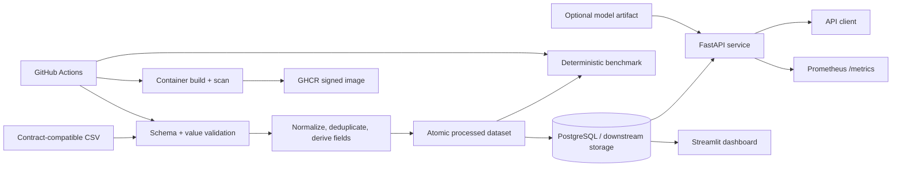
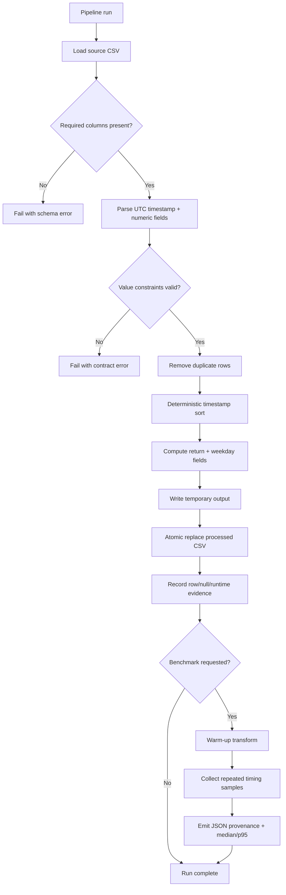
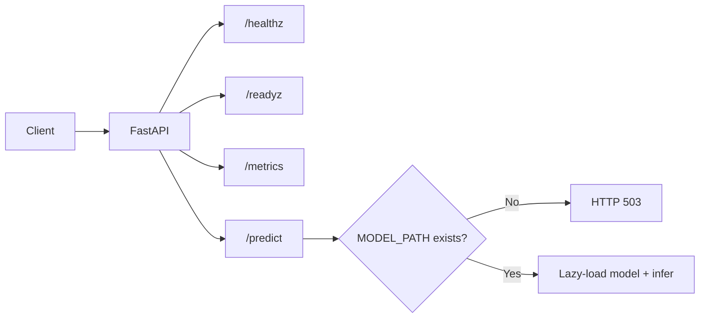

# NYC Finance Data Engineering Project

<p align="center">

[](https://github.com/CoreyLeath-code/NYC-Finance-Data-Engineering-Project/actions/workflows/ci.yml)
[](https://github.com/CoreyLeath-code/NYC-Finance-Data-Engineering-Project/actions/workflows/supply-chain.yml)
[](https://github.com/CoreyLeath-code/NYC-Finance-Data-Engineering-Project/actions/workflows/release.yml)
[](https://github.com/CoreyLeath-code/NYC-Finance-Data-Engineering-Project/releases)
[](https://www.python.org/)
[](LICENSE)

</p>

A portfolio-scale data engineering reference implementation for contract-first ETL, reproducible benchmarking, API serving, observability, container packaging, and deployment validation around synthetic NYC finance time-series data.

> **Evidence boundary:** this repository validates synthetic/local engineering behavior. It does not claim production financial reporting, trading performance, live NYC Finance integration, warehouse-scale throughput, or financial-model accuracy.

## Engineering scope

Implemented:

- Contract-first pandas ETL with schema/value checks, UTC timestamps, deduplication, deterministic ordering, derived fields, and atomic output replacement.
- Reproducible synthetic ETL microbenchmark with JSON evidence and environment metadata.
- FastAPI inference boundary with strict request validation, lazy model loading, health/readiness endpoints, and Prometheus metrics.
- Streamlit dashboard and PostgreSQL-backed local Compose topology.
- Multi-stage non-root container images for API, ETL, and dashboard services.
- Kubernetes manifests validated offline with kubeconform.
- CI with Ruff, Bandit, pytest/coverage, dependency audit, image build/smoke testing, Compose validation, and benchmark artifacts.
- Supply-chain workflow with Trivy scanning, SPDX SBOM generation, GHCR publication, and keyless Cosign signing.
- Semantic-tag GitHub Release workflow with source archive/checksum and manual recovery for existing tags.

Not claimed:

- Production SLOs or multi-region resilience.
- Real-time Kafka/Airflow/Snowflake performance.
- Validated trading or financial forecasting quality.
- Production IAM, retention, encryption, backup, or legal/compliance posture.
- End-to-end warehouse or network throughput from the in-memory benchmark.

## Architecture flowchart



The verified local path is intentionally smaller than a cloud-scale data platform. CSV ETL, local Postgres/Compose, FastAPI, Streamlit, containerization, Kubernetes manifests, CI, benchmark evidence, SBOM generation, and signed release images are represented by repository artifacts. Kafka, Airflow, Snowflake, S3, and multi-region infrastructure remain optional extensions until they have dedicated integration tests and environment-specific evidence.

## System design flowchart



### Serving boundary



The API and ETL are separate runtime boundaries. The repository does not ship a trained model by default, so prediction capability is deliberately gated by model-artifact availability rather than fabricated fallback output.

## Quick Start

Python 3.11 is the verified CI runtime.

### 1. Clone and create an environment

```bash
git clone https://github.com/CoreyLeath-code/NYC-Finance-Data-Engineering-Project.git
cd NYC-Finance-Data-Engineering-Project
python -m venv .venv
```

Activate it:

```bash
# Linux/macOS
source .venv/bin/activate

# Windows PowerShell
.venv\Scripts\Activate.ps1
```

### 2. Install and validate

```bash
python -m pip install --upgrade pip
python -m pip install -r requirements.txt
pytest tests api/test_api.py
```

The CI-equivalent quality path also includes Ruff, Bandit, coverage, dependency audit, Docker image builds, API smoke testing, Compose validation, Kubernetes schema validation, benchmark evidence, and supply-chain scanning.

### 3. Run the local API and dashboard

```bash
docker compose config --quiet
docker compose up --build -d api dashboard
curl --fail http://127.0.0.1:8000/healthz
curl http://127.0.0.1:8000/readyz
curl http://127.0.0.1:8000/metrics
docker compose down
```

### 4. Run the ETL pipeline

Place a contract-compatible CSV at:

```text
data/raw/nyc_finance_synthetic.csv
```

Then run:

```bash
docker compose --profile pipeline run --rm etl
```

### 5. Run the deterministic benchmark

```bash
python benchmarks/pipeline_benchmark.py \
  --rows 100000 \
  --repeats 5 \
  --seed 2026 \
  --output benchmarks/results/latest.json
```

Inspect the machine-readable evidence:

```bash
python -m json.tool benchmarks/results/latest.json
```

## Data contract

| Column | Constraint |
|---|---|
| `timestamp` | parseable timestamp, normalized to UTC |
| `open` | numeric and greater than zero |
| `close` | numeric |
| `volume` | numeric and non-negative |

The pipeline rejects missing columns, invalid values, and empty inputs; removes duplicate rows; sorts by timestamp; derives return and weekday fields; and replaces the processed CSV atomically.

## API contract

| Endpoint | Behavior |
|---|---|
| `GET /` | service identity/status |
| `GET /healthz` | process liveness |
| `GET /readyz` | reports `ready` only when the model path exists; otherwise `degraded` |
| `GET /metrics` | Prometheus exposition |
| `POST /predict` | validates 1–512 numeric features and performs lazy model inference |

If the configured model artifact is absent, prediction returns HTTP 503 rather than silently fabricating output.

## Evidence and reproducibility

The repository treats reproducibility as a contract rather than a README claim. Each evidence type has an expected source and interpretation boundary.

| Evidence class | Repository evidence | What it demonstrates | What it does **not** demonstrate |
|---|---|---|---|
| Correctness | pytest + coverage | tested ETL/API behavior | exhaustive production correctness |
| Static quality | Ruff + Bandit | lint/security-policy conformance | absence of all defects |
| Dependency hygiene | pip-audit | known vulnerable Python dependencies at scan time | future vulnerability absence |
| ETL performance | deterministic JSON benchmark | in-memory transform timing on one environment | warehouse/network/streaming throughput |
| Container runtime | image build + API smoke test | image starts and health endpoint responds | long-duration reliability |
| Deployment shape | Compose + kubeconform | local topology and manifest validity | production cluster behavior |
| Supply chain | Trivy + SPDX SBOM + Cosign | scanned, inventoried, signed release image | complete organizational security posture |
| Release integrity | source archive + SHA-256 | reproducible source snapshot checksum | binary reproducibility across all toolchains |

A benchmark or quality number belongs in a release note only when the command, commit, environment, input size, seed, repeat count, warm-up policy, and artifact location are available. Environment-dependent values are evidence, not universal constants.

### Reproduction checklist

A reviewer should be able to execute the following from a clean checkout:

```bash
python -m venv .venv
source .venv/bin/activate
python -m pip install --upgrade pip
python -m pip install -r requirements.txt
pytest tests api/test_api.py
python benchmarks/pipeline_benchmark.py --rows 100000 --repeats 5 --seed 2026 --output benchmarks/results/latest.json
python -m json.tool benchmarks/results/latest.json
docker build --target api -t nyc-finance-api:local .
docker compose config --quiet
```

For release-grade evidence, also record the commit SHA, runner/CPU, OS, dependency versions, source-data identifier, storage mode, cache state, and workflow run that produced the result.

## Research-style benchmark and metrics

### Research question

> Under a deterministic synthetic workload, how reliably and efficiently does the contract-first in-memory transformation normalize, validate, deduplicate, derive fields, and preserve expected output integrity?

### Experimental protocol

| Parameter | Protocol |
|---|---|
| Dataset | deterministic synthetic time-series data |
| Default rows | 100,000 |
| Seed | 2026 |
| Timed repeats | 5 |
| Warm-up | explicit untimed transform before recorded samples |
| Clock | high-resolution monotonic performance clock |
| Primary latency statistics | median and p95 transform duration |
| Throughput statistic | median rows per second |
| Integrity statistics | output rows and null-cell count |
| Provenance | Python, pandas, NumPy, platform, processor/CPU, commit/CI metadata when available |
| Output | versionable JSON artifact |

### Metrics schema

The benchmark records metrics such as:

```text
metrics
├── median_seconds
├── p95_seconds
├── median_rows_per_second
├── output_rows
└── null_cells

samples_seconds
└── one value per measured iteration
```

### Interpretation

The benchmark measures **in-memory pandas transformation work**. It does not include real network transport, Kafka, cloud object storage, Snowflake, Postgres write throughput, Airflow scheduling, concurrent API load, or cross-region latency. Therefore, it is useful for regression detection and implementation comparison but not as a production capacity claim.

A result should be reported in research style, for example:

> Commit `<sha>` processed a deterministic synthetic dataset of 100,000 rows with seed 2026 using five timed repetitions after one warm-up iteration. Median and p95 transform latency, rows/sec, output-row count, null-cell count, dependency versions, and runner metadata were captured in the corresponding JSON artifact.

This format intentionally avoids publishing an isolated speed number without context.

## Deployment and supply chain

Local image validation:

```bash
docker build --target api -t nyc-finance-api:local .
docker build --target etl -t nyc-finance-etl:local .
docker build --target dashboard -t nyc-finance-dashboard:local .
```

The API container runs as non-root UID/GID `10001:10001` and exposes a live health check. The image build applies available Debian security updates before package installation, and release images remain blocked when Trivy reports fixable HIGH/CRITICAL findings.

A semantic version tag produces:

```text
vX.Y.Z
├── GitHub Release
│   ├── nyc-finance-data-engineering-vX.Y.Z.tar.gz
│   └── nyc-finance-data-engineering-vX.Y.Z.sha256
└── GHCR
    └── ghcr.io/coreyleath-code/nyc-finance-data-engineering-project:vX.Y.Z
```

The supply-chain workflow additionally generates an SPDX SBOM and signs the release image with keyless Cosign. The release and supply-chain workflows can be manually dispatched for an existing semantic tag when recovery is needed.

## Engineering roadmap

The roadmap is evidence-driven: a capability moves from planned to verified only when code, tests, and reproducible evidence exist in the repository.

| Priority | Work item | Acceptance evidence | Status |
|---|---|---|---|
| P0 | Versioned representative dataset fixture | checksum, license/provenance metadata, deterministic fixture | Planned |
| P0 | Schema-evolution policy | tests for missing/renamed/new columns plus reject/quarantine/migrate behavior | Planned |
| P0 | Postgres integration boundary | Testcontainers-backed writes, retry/idempotency, failure recovery | Planned |
| P0 | Readiness semantics | failing readiness status when required artifact is absent | Planned |
| P1 | End-to-end load test | fixed concurrency matrix, p50/p95/p99, throughput, errors, CPU/memory | Planned |
| P1 | Data lineage record | source ID/checksum, schema version, transform commit, output/run ID | Planned |
| P1 | Release provenance | attach SBOM/provenance artifacts directly to GitHub Release | Planned |
| P1 | Model artifact provenance | immutable digest plus training/evaluation lineage | Planned |
| P2 | Orchestration integration | environment-backed Airflow workflow tests | Optional extension |
| P2 | Streaming integration | live Kafka/Testcontainers contract and recovery tests | Optional extension |
| P2 | Warehouse integration | Snowflake or equivalent integration test and cost/performance evidence | Optional extension |
| P2 | Production controls | IAM, encryption, retention, backup/restore, incident-response evidence | Environment-specific |

### Definition of done for roadmap items

A roadmap item is not considered implemented merely because a dependency, config file, or architecture diagram mentions it. Completion requires executable code, automated verification, failure-path coverage where applicable, and documentation that states exactly what the evidence proves.

## L6 engineering assessment

Current strengths include a clear data contract and failure behavior, deterministic benchmark evidence, API liveness/readiness separation, lazy artifact loading, non-root multi-stage images, Compose and Kubernetes validation, dependency/image scanning, SBOM generation, and signed release images.

The largest remaining gaps are at the integration and environment boundaries: representative dataset lineage, schema evolution, storage-boundary tests, controlled load experiments, stricter readiness behavior, artifact provenance, IAM/encryption/retention, backup/restore, and incident-response evidence.

See [L6_AUDIT.md](L6_AUDIT.md) for the detailed engineering review.

## Extended reviewer Q&A

**Does the benchmark prove production throughput?**  
No. It is an in-memory synthetic transform microbenchmark. Production capacity requires real storage/network boundaries, concurrency, repeated trials, saturation analysis, error rates, and resource utilization.

**Why use a deterministic synthetic dataset?**  
It provides a stable regression workload with a controlled seed and avoids claiming that private or changing external financial data is reproducible. A representative versioned external fixture remains a roadmap item.

**Why publish individual timing samples instead of only an average?**  
Raw samples make the result auditable and allow reviewers to inspect spread and recompute statistics rather than trusting one headline number.

**Why use median and p95?**  
Median is less sensitive to one unusually slow run than an arithmetic mean, while p95 captures tail behavior within the measured sample. With a small repeat count, p95 is still only a lightweight regression signal rather than a production latency SLO.

**Why separate `/healthz` and `/readyz`?**  
Liveness answers whether the process is running; readiness answers whether the service has what it needs to serve its intended workload. The current endpoint reports degraded state when the model is missing; returning a failing HTTP readiness status is on the roadmap when model availability becomes a required serving condition.

**Why does `/predict` return 503 when there is no model?**  
The repository deliberately avoids fake inference behavior. Missing operational dependencies should surface as explicit service unavailability rather than fabricated predictions.

**Is Kafka part of the verified architecture?**  
No. Kafka may appear in exploratory or historical material, but it is not part of the validated default path until live broker integration tests and measured evidence are added.

**Is Snowflake part of the verified architecture?**  
No. Warehouse integration is intentionally treated as optional until credentials, schema setup, integration tests, workload definitions, cost controls, and environment-specific measurements exist.

**Why is Postgres shown if the benchmark is in memory?**  
The local Compose topology includes PostgreSQL as a downstream storage/service boundary, but the benchmark intentionally measures the transform function in isolation. Those are separate pieces of evidence and should not be conflated.

**Why not publish one large throughput number in the README?**  
A single number without commit, hardware, input size, warm-up, repeat count, storage mode, cache state, and artifact provenance is easy to misinterpret. This project favors reproducible evidence over marketing-style performance claims.

**What does the coverage gate prove?**  
It proves that a minimum fraction of the selected modules is exercised by tests in CI. It does not prove complete behavioral correctness, strong mutation-test quality, or production safety.

**What happens when the container scan finds fixable HIGH/CRITICAL vulnerabilities?**  
The supply-chain workflow fails rather than silently waiving the finding. The image build applies available OS security updates, and the release remains gated by Trivy.

**Why publish both a GitHub Release and a GHCR package?**  
The GitHub Release provides an inspectable source snapshot and SHA-256 checksum; GHCR provides a versioned execution artifact. Together they separate source provenance from deployable container provenance.

**What does Cosign add?**  
It provides cryptographic signing for the release container so consumers can verify that the published image was signed through the configured release identity path. It does not replace vulnerability scanning or organizational access controls.

**What would make this production-authorized?**  
Environment-specific identity/access controls, secrets management, encryption, retention, backup/restore, durable lineage, real storage integration, load testing, monitoring/alerting, incident response, compliance review, and documented operational ownership—not additional badges.

**What is the next highest-value engineering upgrade?**  
A versioned representative dataset plus lineage metadata and Postgres integration tests would close two of the largest gaps between isolated transformation evidence and a credible end-to-end data-platform story.

## Repository map

```text
api/                     FastAPI inference and operations API
benchmarks/              deterministic ETL benchmark
src/pipelines/           ETL contracts and transformation
dashboard/               Streamlit visualization
requirements/            service-specific dependencies
infra/k8s/               deployment/service/network-policy manifests
tests/                   ETL tests
.github/workflows/       CI, supply-chain, release automation
docs/                    engineering/deployment evidence
L6_AUDIT.md              detailed senior engineering review
```

## License

See [LICENSE](LICENSE). Dataset licensing and financial-data obligations are separate from the source-code license.
