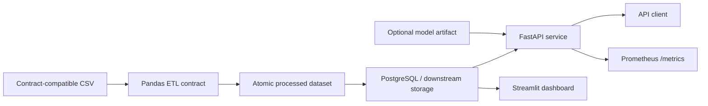
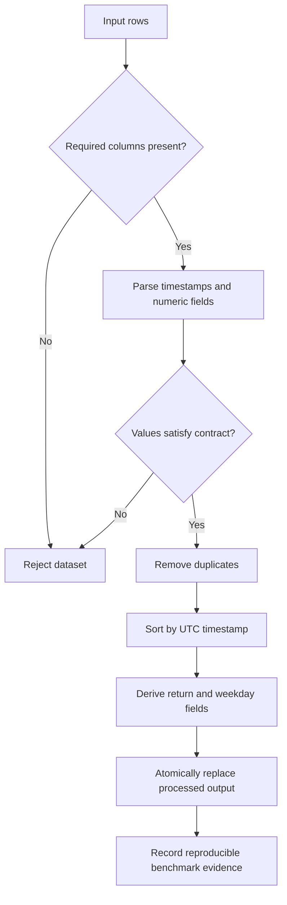

# NYC Finance Data Engineering Project

[](https://github.com/CoreyLeath-code/NYC-Finance-Data-Engineering-Project/actions/workflows/ci.yml)
[](https://github.com/CoreyLeath-code/NYC-Finance-Data-Engineering-Project/actions/workflows/supply-chain.yml)
[](https://github.com/CoreyLeath-code/NYC-Finance-Data-Engineering-Project/actions/workflows/release.yml)
[](LICENSE)

A portfolio-scale data engineering reference implementation for contract-first ETL, reproducible benchmarking, API serving, observability, container packaging, and deployment validation around synthetic NYC finance time-series data.

> **Evidence boundary:** this repository validates synthetic/local engineering behavior. It does not claim production financial reporting, trading performance, live NYC Finance integration, warehouse-scale throughput, or financial-model accuracy.

## Engineering scope

Implemented:

- Contract-first pandas ETL with schema/value checks, UTC timestamps, deduplication, deterministic ordering, derived fields, and atomic output replacement.
- Reproducible synthetic ETL microbenchmark with JSON evidence and environment metadata.
- FastAPI inference boundary with strict request validation, lazy model loading, health/readiness endpoints, and Prometheus metrics.
- Streamlit dashboard and PostgreSQL-backed local Compose topology.
- Multi-stage non-root container images for API, ETL, and dashboard services.
- Kubernetes manifests validated offline with kubeconform.
- CI with Ruff, Bandit, pytest/coverage, dependency audit, image build/smoke testing, Compose validation, and benchmark artifacts.
- Supply-chain workflow with Trivy scanning, SPDX SBOM generation, GHCR publication, and keyless Cosign signing.
- Semantic-tag GitHub Release workflow with source archive/checksum and manual recovery for existing tags.

Not claimed:

- Production SLOs or multi-region resilience.
- Real-time Kafka/Airflow/Snowflake performance.
- Validated trading or financial forecasting quality.
- Production IAM, retention, encryption, backup, or legal/compliance posture.
- End-to-end warehouse or network throughput from the in-memory benchmark.

## Architecture



## System design flow



The ETL and API are separate runtime boundaries. The API only loads a model when `/predict` is called; the repository does not ship a trained model by default.

## Quickstart

Python 3.11 is the verified CI runtime.

```bash
git clone https://github.com/CoreyLeath-code/NYC-Finance-Data-Engineering-Project.git
cd NYC-Finance-Data-Engineering-Project
python -m venv .venv
source .venv/bin/activate   # Windows: .venv\Scripts\activate
python -m pip install --upgrade pip
python -m pip install -r requirements.txt
pytest tests api/test_api.py
```

Run the local service topology:

```bash
docker compose config --quiet
docker compose up --build -d api dashboard
curl --fail http://127.0.0.1:8000/healthz
curl http://127.0.0.1:8000/readyz
curl http://127.0.0.1:8000/metrics
docker compose down
```

Run ETL after placing a contract-compatible CSV at `data/raw/nyc_finance_synthetic.csv`:

```bash
docker compose --profile pipeline run --rm etl
```

## Data contract

| Column | Constraint |
|---|---|
| `timestamp` | parseable timestamp, normalized to UTC |
| `open` | numeric and greater than zero |
| `close` | numeric |
| `volume` | numeric and non-negative |

The pipeline rejects missing columns, invalid values, and empty inputs; removes duplicate rows; sorts by timestamp; derives return and weekday fields; and replaces the processed CSV atomically.

## API contract

| Endpoint | Behavior |
|---|---|
| `GET /` | service identity/status |
| `GET /healthz` | process liveness |
| `GET /readyz` | reports `ready` only when the model path exists; otherwise `degraded` |
| `GET /metrics` | Prometheus exposition |
| `POST /predict` | validates 1–512 numeric features and performs lazy model inference |

If the configured model artifact is absent, prediction returns HTTP 503 rather than silently fabricating output.

## Reproducibility

Run the deterministic ETL microbenchmark:

```bash
python benchmarks/pipeline_benchmark.py \
  --rows 100000 \
  --repeats 5 \
  --seed 2026 \
  --output benchmarks/results/latest.json
```

The benchmark records:

- synthetic dataset row count and seed
- repeat count and cache/warm-up policy
- median and p95 transform duration
- median rows/second
- output rows and null-cell count
- individual timing samples
- Python, pandas, NumPy, OS/platform, processor, and commit provenance when available

CI also runs a smaller benchmark smoke test and uploads the JSON result together with coverage evidence.

### Research-style interpretation

This benchmark measures **in-memory ETL transform work**. It does not include real network transport, Kafka, cloud object storage, a warehouse, Postgres ingest throughput, Airflow scheduling, or concurrent service load. Results are environment-specific and should be reported with commit SHA, runner/hardware, row count, seed, repeats, storage mode, cache state, and dependency versions.

No numeric throughput or latency claim belongs in the README unless the exact versioned artifact that produced it is committed or linked.

## Deployment and supply chain

Local image validation:

```bash
docker build --target api -t nyc-finance-api:local .
docker build --target etl -t nyc-finance-etl:local .
docker build --target dashboard -t nyc-finance-dashboard:local .
```

The API container runs as non-root UID/GID `10001:10001` and exposes a live health check. Release tags are scanned before publication; the supply-chain workflow generates an SPDX SBOM and publishes the API image to GHCR.

A semantic version tag also triggers the release workflow, producing:

```text
vX.Y.Z
├── GitHub Release
│   ├── nyc-finance-data-engineering-vX.Y.Z.tar.gz
│   └── nyc-finance-data-engineering-vX.Y.Z.sha256
└── GHCR
    └── ghcr.io/coreyleath-code/nyc-finance-data-engineering-project:vX.Y.Z
```

The release workflow can be manually dispatched with an existing semantic version tag if GitHub does not dispatch a tag event automatically.

## L6 engineering assessment

Strongest areas:

- clear data contract and failure behavior
- deterministic benchmark with machine-readable results
- API liveness/readiness separation and lazy artifact loading
- non-root multi-stage service images
- Compose + Kubernetes validation
- dependency/image scanning, SBOM generation, and signed GHCR releases

Highest-value next steps:

1. Add a versioned representative dataset fixture with lineage metadata and explicit licensing.
2. Add schema-evolution and quarantine behavior for upstream contract drift.
3. Add Postgres integration tests with retry/idempotency and failed-write recovery.
4. Add controlled end-to-end load tests across ETL storage and API boundaries.
5. Make readiness return a failing HTTP status when the model is required but absent.
6. Pin deployable model artifacts by digest and record model/data lineage together.
7. Add environment-specific IAM, encryption, backup/restore, retention, and incident-response evidence before claiming production authorization.

See [L6_AUDIT.md](L6_AUDIT.md) for the detailed review.

## Reviewer Q&A

**Does the benchmark prove production throughput?**  
No. It is an in-memory synthetic transform microbenchmark. Production capacity requires real storage/network boundaries, concurrency, repeated trials, and saturation/error analysis.

**Why separate `/healthz` and `/readyz`?**  
Liveness answers whether the process is running; readiness answers whether a required model artifact is available. That distinction prevents process health from being confused with serving capability.

**Is Kafka or Snowflake part of the verified default path?**  
No. Those technologies may appear in exploratory/history modules, but the verified local contract is CSV ETL, Postgres/Compose, FastAPI, Streamlit, containerization, and Kubernetes manifests.

**Why publish both a GitHub Release and GHCR package?**  
The release archives an inspectable source snapshot plus checksum, while GHCR provides the versioned execution artifact for the API service.

**What would make this production-authorized?**  
Environment-specific identity/access controls, encryption, retention, backup/restore, data lineage, representative load testing, incident response, and compliance review—not additional badges.

## Repository map

```text
api/                     FastAPI inference and operations API
benchmarks/              deterministic ETL benchmark
src/pipelines/           ETL contracts and transformation
dashboard/               Streamlit visualization
requirements/            service-specific dependencies
infra/k8s/               deployment/service/network-policy manifests
tests/                   ETL tests
.github/workflows/       CI, supply-chain, release automation
docs/                    engineering/deployment evidence
```

## License

See [LICENSE](LICENSE). Dataset licensing and financial-data obligations are separate from the source-code license.
